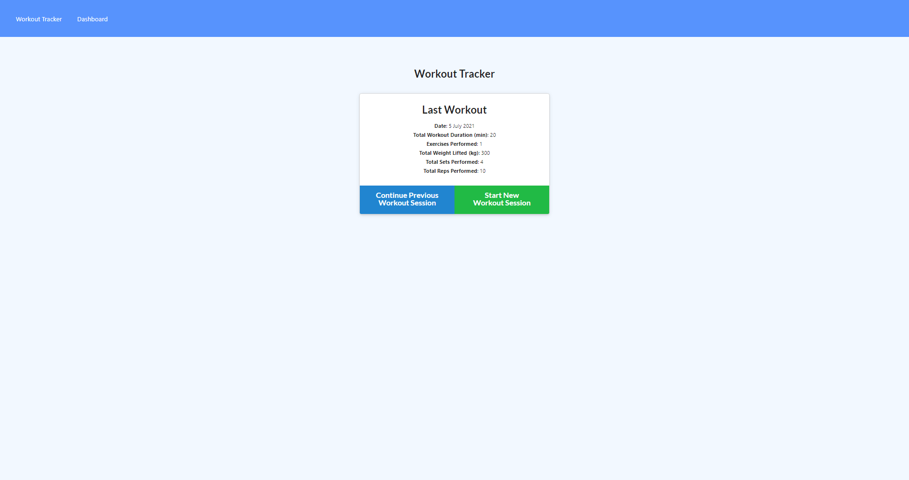
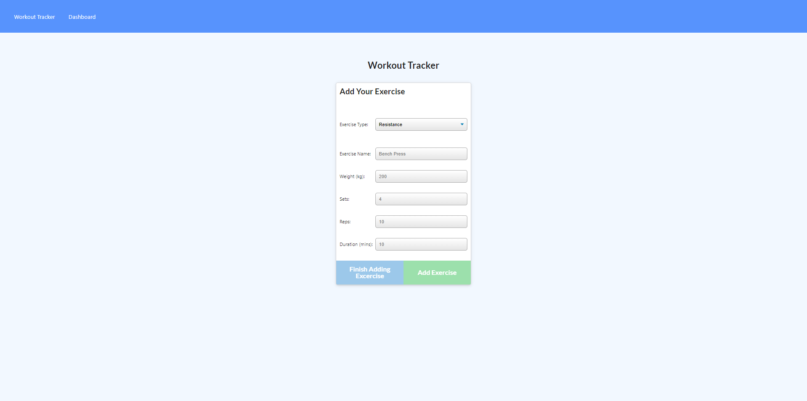
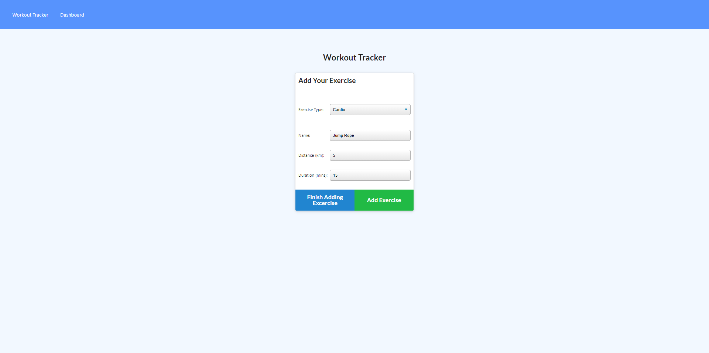
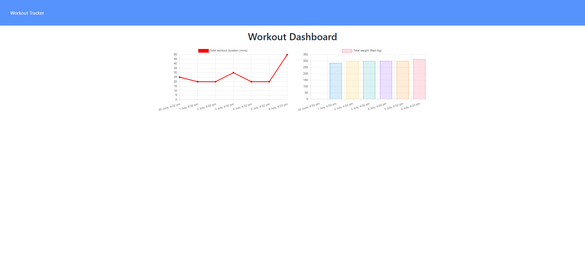

# Workout Tracker

Link to the deployed application can be tested here on Heroku: [Workout Tracker App](https://fitness-tracker-lh.herokuapp.com/) and the project repository can be viewed here: [Workout Tracker Repo](https://github.com/leonhsu95/fitness-tracker).

## Description

Workout Tracker is a simple app that helps you log all the exercises you have created, stores them into a NoSQL Database. You can store both Resistance and Cardio exercises with their unique information and data fields and finally mark them as complete when done.

## Table of Contents

- [Installation](#installation)
- [Credits](#credits)
- [Usage](#usage)
- [License](#license)
- [Features](#features)
- [Tests](#tests)


## Installation

To install the files for testing into your local repo, using Git Bash Terminal:

1) Create a folder locally to nominate for cloning from online repo
2) Clone with SSH by

```GitBash Commands
git clone git@github.com:leonhsu95/fitness-tracker.git
 ```

Additionally, please install [NodeJS](https://nodejs.org/en/) and the below npm packages

```Terminal Commands
npm i init -y
npm i
npm i dotenv
npm i express
npm i mongoose
npm i nodemon

 ```

Before you run the code, please change scripts:{start: } to 'node server.js' in the package.json file and change your database login credentials in the (dotenv).env file.

[MongoDB](https://www.mongodb.com/try/download/community)

## Credits

The initial template for the backend is created by University of Sydney and Trilogy Education.
All other codes and functionalities are developed by Leon Hsu [leonhsu95](https://github.com/leonhsu95)

## Usage

The project should look like this:  
  
  
  
  

## License

Copyright 2021 © Leon Hsu [leonhsu95](https://github.com/leonhsu95). All rights reserved.
Licensed under the [MIT](https://opensource.org/licenses/MIT).

Permission is hereby granted, free of charge, to any person obtaining a copy
of this software and associated documentation files (the "Software"), to deal
in the Software without restriction, including without limitation the rights
to use, copy, modify, merge, publish, distribute, sublicense, and/or sell
copies of the Software, and to permit persons to whom the Software is
furnished to do so, subject to the following conditions:

The above copyright notice and this permission notice shall be included in all
copies or substantial portions of the Software.

THE SOFTWARE IS PROVIDED "AS IS", WITHOUT WARRANTY OF ANY KIND, EXPRESS OR
IMPLIED, INCLUDING BUT NOT LIMITED TO THE WARRANTIES OF MERCHANTABILITY,
FITNESS FOR A PARTICULAR PURPOSE AND NONINFRINGEMENT. IN NO EVENT SHALL THE
AUTHORS OR COPYRIGHT HOLDERS BE LIABLE FOR ANY CLAIM, DAMAGES OR OTHER
LIABILITY, WHETHER IN AN ACTION OF CONTRACT, TORT OR OTHERWISE, ARISING FROM,
OUT OF OR IN CONNECTION WITH THE SOFTWARE OR THE USE OR OTHER DEALINGS IN THE
SOFTWARE.

## Features

- The application allows users to save fitness exercises into MongoDB and if connection fails, with IndexedDB.
- Users can save two types of exercises with different keys and values: Resistance and Cardio training.
- Each exercise can be marked as complete by the user which is also saved in the database.


## Tests

This project can be tested with [JS Validation Service](https://jshint.com/). The [Insomnia](https://insomnia.rest/) Design and API Client 
is used to test these functionalities as it can GET, POST, PUT and DELETE Data from the given URL without Front End UI Buttons or Designs.
You will also require [MongoDB](https://www.mysql.com/products/community/) and [Robot 3T](https://dev.mysql.com/downloads/workbench/) for this application's database.


